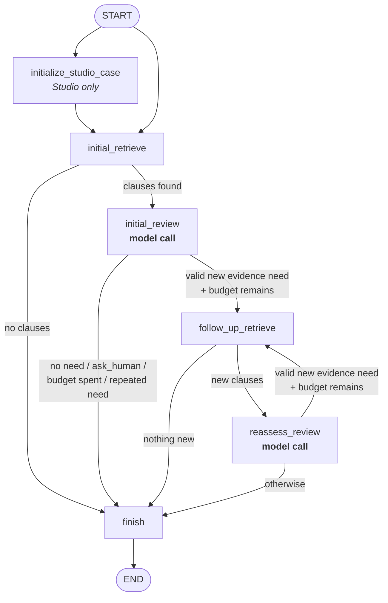

# Demo

This file is self-contained. It covers installing the project, every entry point,
and how one case evaluation run actually flows through the system. Part 1 is an
ordered demo script; Part 2 is reference material you can read out of order.

The project investigates whether a controlled corpus of corporate policies
coherently answers a policy-owner question. The domain is employee, contractor,
and partner-assignee access revocation during offboarding.

---

# Part 1 — Demo run order

## 0. Before the demo

```bash
uv sync
```

```bash
cp .env.example .env
```

Then edit `.env` and set `OPENAI_API_KEY` (or `ANTHROPIC_API_KEY` with
`LLM_PROVIDER=anthropic`). Optionally set `LANGSMITH_TRACING=true` and
`LANGSMITH_API_KEY` if you intend to show traces.

Warm the caches so nothing stalls live:

```bash
uv run pytest
```

```bash
uv run python -m evals.run_retrieval_benchmark
```

**Cost note for the presenter:** everything in step 1 and step 2 below is free
and deterministic. Steps 3 onward call a model provider and consume tokens.

## 1. Show the material — what the agent is up against (free)

```bash
uv run policy-coherence-investigator-cases
```

Open <http://127.0.0.1:8766>.

What to point at:

- Four synthetic cases, `access-offboarding-a` through `-d`. Each is a policy
  question plus a controlled corpus of ~10 short Markdown policy documents.
- Expand a corpus document. Show that clauses are addressable units:
  `## ACP-4.2.1 — Privileged access at termination`. That heading pattern is what
  the loader parses into a citable clause.
- The demo notes marked as evaluation material. **Say out loud that these are
  page-only**: the explorer deliberately loads the hidden oracle so a human
  audience can see why a case is interesting, and that oracle never reaches the
  investigator.
- Contrast two cases so the audience understands there is no single right answer
  shape: `access-offboarding-b` is an *apparent* conflict that resolves once the
  definitions document distinguishes ordinary from privileged accounts;
  `access-offboarding-d` asks about `partner_assignee`, a population the corpus
  may not govern at all.

## 2. Show the retrieval floor (free, deterministic)

```bash
uv run python -m evals.run_retrieval_benchmark
```

This runs against `access-lifecycle-large` (24 documents) and compares the
lexical retriever against a vector retriever using a deterministic offline
embedding fake. Point out that it never calls a provider — retrieval quality is
measured separately from model behaviour, so a bad end-to-end result can be
attributed to one or the other.

## 3. Run one case end to end (paid)

```bash
uv run python -m evals.run_case access-offboarding-b --provider openai
```

You get one compact line plus a summary:

```
access-offboarding-b: PASS | bounded | category=apparent_conflict_resolved | retrievals=2/3 | followups=retrieve_definition | termination=decision_complete | retriever=lexical
```

Read that line field by field — it is the whole story of the run:

- `category` — which of three mutually exclusive outcomes the model chose.
- `retrievals=2/3` — it spent two of its three permitted retrieval iterations.
- `followups=retrieve_definition` — after the first review it asked for a
  definition, which is exactly the move that resolves this case.
- `termination=decision_complete` — it stopped because it was done, not because
  it hit a limit.
- `PASS` — the deterministic evaluator, which loaded the hidden oracle only
  *after* the graph finished, accepted the category, the required finding, the
  required scope distinction, and the citation of a decisive clause set.

## 4. Contrast the two architectures (paid)

```bash
uv run python -m evals.run_case access-offboarding-b --architecture baseline --provider openai
```

The baseline does exactly one retrieval and one review — no follow-up. This is
the demo's central point: the bounded loop earns its complexity only when a
single retrieval leaves a material uncertainty. Run the same comparison on
`access-offboarding-d` if you want a case where the honest answer is
"the evidence does not govern this population".

## 5. Show the graph visually (paid per submitted run)

```bash
uv run langgraph dev
```

Open the printed LangGraph Studio URL for `http://127.0.0.1:2024`, pick the
`access-offboarding-b` graph, and submit `{}` as input. Studio shows the nodes,
the route the run actually took, and the state at each node — set a breakpoint on
`follow_up_retrieve` to freeze the run at the moment the model has asked for more
evidence and let the audience read the requested `EvidenceNeed` before it is
acted on.

Studio graphs load only agent-visible case data and never the oracle, which is
why evaluation stays in `evals/run_case.py`.

## 6. Let someone else drive (paid per submitted run)

```bash
uv run policy-coherence-investigator-workbench --provider openai
```

Open <http://127.0.0.1:8767>. Selecting a case fills in its corpus, question,
date, geography, and retrieval budget; the audience can then edit the question or
narrow the scope and run one bounded review. Good closing move: widen the
populations on a case and watch the category shift from resolved to a coverage
gap.

## 7. Optional — show the traces

If `LANGSMITH_TRACING=true` was set, open the LangSmith project named in
`.env` (`policy-coherence-investigator-dev` by default) and walk one trajectory:
the graph path, both model calls, token counts, and latency. Note that traces
contain prompts and responses — fine here because every corpus is synthetic.

---

# Part 2 — Reference

## Installation

Requires **Python 3.12** and [uv](https://docs.astral.sh/uv/). The pinned
interpreter is in `.python-version`; `uv` will fetch it if missing.

```bash
uv sync
```

That installs the runtime dependencies (`langgraph`, `langchain-openai`,
`langchain-anthropic`, `langsmith`, `pydantic`, `pyyaml`, `python-dotenv`) and
the `dev` group (`pytest`, `ruff`, `langgraph-cli[inmem]`), and installs this
project itself so the four console scripts resolve.

### Configuration

```bash
cp .env.example .env
```

| Variable | Purpose |
| --- | --- |
| `LLM_PROVIDER` | `openai` or `anthropic`. Overridable per command with `--provider`. |
| `OPENAI_API_KEY` / `OPENAI_MODEL` | OpenAI credentials and model. Model defaults to `gpt-5.4-mini`. |
| `ANTHROPIC_API_KEY` / `ANTHROPIC_MODEL` | Anthropic credentials and model. Model defaults to `claude-sonnet-4-6`. |
| `LANGSMITH_TRACING` | `true` to emit traces. LangGraph and the LangChain integrations trace automatically; there is no instrumentation in the graph code. |
| `LANGSMITH_API_KEY` / `LANGSMITH_PROJECT` | LangSmith credentials and target project. |

A key is only needed for commands that invoke a model. The deterministic test
suite must never call a provider.

### Verify the install

```bash
uv run pytest
```

```bash
uv run ruff check .
```

Both are free and offline. If `pytest` passes, corpus loading, clause parsing,
applicability filtering, retrieval ranking, ledger bookkeeping, routing, and
evaluation are all working; only the model calls remain unproven.

### What is disposable

`data/generated/`, `evals/runs/`, `artifacts/`, `local/`, and `.langgraph_api/`
are generated or throwaway output. `local/vector-cache/` holds cached embedding
vectors keyed by corpus and embedding model, so a repeated vector run does not
re-pay for embeddings.

## Entry points

Four console scripts are declared in `pyproject.toml` under
`[project.scripts]`. All four are local, and all four bind to `127.0.0.1` by
default.

### `policy-coherence-investigator`

`src/policy_coherence_investigator/interfaces/investigate.py`

The oracle-free command-line investigator. This is the "use the system for real"
surface: you supply the question and the review scope, it loads a corpus
directory off disk, runs the bounded investigation graph, and prints the
structured result plus concise run metadata as JSON (or `--format text`).

It never loads an evaluation oracle and never reports pass/fail — there is
nothing to compare against, by design. It consumes tokens.

```bash
uv run policy-coherence-investigator \
  --question "Do contractor offboarding policies conflict?" \
  --corpus evals/corpora/access-offboarding-a \
  --as-of 2026-08-16 \
  --geography global \
  --population employee \
  --population contractor \
  --access-type ordinary \
  --access-type privileged \
  --provider openai
```

Flags that matter: `--population` and `--access-type` are repeatable and define
the in-scope matrix the model must reason across; `--as-of` and `--geography`
drive the deterministic applicability filter *before* any retrieval;
`--retrieval-budget` (default 3) caps the loop; `--retriever` selects `lexical`
or `vector` and **defaults to `vector`** here, unlike the eval runners, which
default to `lexical`.

### `policy-coherence-investigator-cases`

`src/policy_coherence_investigator/interfaces/case_explorer.py` · port **8766**

A read-only local case explorer for humans. It renders each evaluation case: the
question, the review context, the corpus documents (collapsed by default), and
the clearly-marked demo notes drawn from `evals/presentation/cases.yaml`.

It deliberately loads the hidden oracle so a demo audience can see why a case is
interesting. That is safe only because this module is imported by no prompt, no
workflow, and no evaluation runner. It runs no model and no evaluation
trajectory, so it is free.

### `policy-coherence-investigator-workbench`

`src/policy_coherence_investigator/interfaces/workbench.py` · port **8767**

The combined explorer and single-shot investigator. Selecting a case seeds its
corpus, question, date, geography, and retrieval budget into an editable form;
submitting runs exactly one bounded investigation and renders the findings with
their citations. It reuses the explorer's rendering and the CLI's
`run_investigation`, so what you see matches what the CLI would print.

The explorer's oracle-backed demo notes stay page-only and are never supplied to
the investigator. Each submission consumes tokens.

### `policy-coherence-investigator-docs`

`src/policy_coherence_investigator/interfaces/doc_viewer.py` · port **8768**

A standalone Markdown viewer, unrelated to the investigator: point it at any
Markdown file and it renders images and collapsible `<details>` sections, always
starting collapsed, and reloads when the file changes on disk. Useful for reading
`docs/` during a demo. It has no dependency on the investigator, evaluation, or
case data, and must stay that way.

```bash
uv run policy-coherence-investigator-docs docs/current/short-term-scope.md
```

## The logical flow of a case evaluation run

This section follows `uv run python -m evals.run_case access-offboarding-b`
from disk to verdict.

### Stage 1 — Case data

A case is two YAML files in `evals/cases/<case-id>/`, split along a hard
boundary.

`case.yaml` is **agent-visible**. It names the corpus, the question, the review
context (`as_of_date`, `geography`, `populations`, `access_types`), and a
`retrieval_budget` constrained to 1–3.

`oracle.yaml` is **evaluator-only**: acceptable result categories, one or more
`decisive_clause_sets` the result must fully cite, required and forbidden finding
IDs, required scope distinctions, and acceptable follow-up evidence needs.

`case_data/loader.py` enforces the split with two separate functions. `load_case`
returns a `CaseInput` and physically cannot reach the oracle; `load_oracle` is an
explicit second call, and it additionally validates that every clause the oracle
points at actually exists in the corpus, so a stale oracle fails loudly rather
than silently failing every run. Both models forbid undeclared fields, and
fixture paths are checked against directory escape.

The corpus lives in `evals/corpora/<corpus-id>/`: a `corpus.yaml` manifest plus
Markdown policy documents. Each manifest entry carries the metadata the
deterministic layer needs — `document_id`, `document_type`, `effective_from`,
`status` (`current` or `superseded`), `authority_level`, and `geography`.
`retrieval/corpus.py` parses each document into clauses on the heading pattern
`## <CLAUSE-ID> — <heading>`, and requires clause IDs to be unique across the
corpus.

### Stage 2 — Deterministic pre-filter

Before any retrieval, `filter_applicable_clauses` drops every clause whose
document is `superseded`, whose `effective_from` is after the review's
`as_of_date`, or whose geography does not cover the review geography (`global`
always matches).

This is load-bearing: the corpora contain deliberate traps such as
`access-control-policy-v3` alongside `-v4`. The model never sees the superseded
version, because version and date reasoning is arithmetic, not judgement, and the
repository's rule is to keep that class of work outside prompts.

### Stage 3 — Retrieval

Retrieval is clause-level and pluggable behind the `ClauseRetriever` protocol.
`LexicalClauseRetriever` scores corpus-local TF/IDF with deterministic
tie-breaking; `VectorClauseRetriever` embeds clauses and caches the vectors under
`local/vector-cache/`, with a deterministic offline fake available so vector
behaviour can be tested without paying.

Each retrieval call ranks all applicable clauses, discards anything already
retrieved in this run, and returns at most `DEFAULT_RETRIEVAL_LIMIT` (5) new
clauses. Both architectures in a comparison must use the same retriever —
otherwise an outcome difference could reflect retrieval quality rather than the
architecture's trajectory.

### Stage 4 — The LangGraph flow

`workflows/bounded_investigation.py` builds the graph. It is a bounded loop, not
an open-ended agent: at most three retrievals, each one justified.



- **`initialize_studio_case`** exists only when the graph is built with an
  `initial_case`, which is how the Studio entry points let you submit `{}`. The
  eval runner passes the question and scope explicitly and skips this node.
- **`initial_retrieve`** creates the ledger, spends one retrieval iteration, and
  short-circuits to `finish` if the budget was zero or nothing was retrieved.
- **`initial_review`** is the first model call.
- **`follow_up_retrieve`** runs the model's requested query, excluding clauses
  already seen.
- **`reassess_review`** re-reviews with the enlarged evidence set and the prior
  result attached as provisional reasoning.
- **`finish`** promotes `current_result` to `final_result` and records why the
  run stopped.

The routing decision is deterministic code, not a model choice.
`route_next_evidence_need` in `workflows/investigation_policy.py` validates the
model's proposed `EvidenceNeed` and returns one of five routes, which become the
run's `termination_reason`:

| Condition | Route / termination reason |
| --- | --- |
| No evidence need requested | `decision_complete` |
| Need is `ask_human` | `human_escalation_requested` |
| No retrieval budget left | `retrieval_budget_exhausted` |
| Same `(kind, target)` already requested | `repeated_evidence_need` |
| Otherwise | follow-up retrieval |

The repeated-need check is what stops a rephrasing loop: asking the same question
in different words does not buy another retrieval.

### Stage 5 — State

A run carries more state than the answer it returns, and the extra state is not
bookkeeping for its own sake. Each piece exists to make one question answerable
after the fact: *what was this conclusion based on, and could it have been reached
honestly?*

State is split in two. The graph state is working memory — what the current step
needs in order to run. The `InvestigationLedger` inside it is the reviewable
trail — what a human or the evaluator needs in order to judge the run. The split
exists because those two audiences want different things: the next node needs the
clauses, while a reviewer needs to know which query pulled them in and why.

#### The one-way valve

There is exactly one channel from the model into the state: the structured
`InvestigationResult` returned by a review. Everything the model contributes
arrives through it — the category, the summary, the cited findings, the scope
assumptions, an optional revised scope, unresolved questions, and at most one
request for more evidence.

Nothing else in the state is model-authored. The retrieved clauses, the retrieval
records, the spent budget, the route taken, and the reason the run stopped are all
produced by deterministic code around the model. This is what makes the run
auditable: the model's contribution is a bounded, typed object, and everything
used to check that object was computed independently of it.

Flowing the other way, the model sees only a deliberately narrow slice of state,
and each review is a fresh conversation rather than a growing message history.

#### What the model is shown

- **The question**, unchanged from the case.
- **The working scope** — the populations, access types, geography, and as-of date
  it must reason across. Handing this over explicitly is the point: the model is
  told what "in scope" means rather than inferring it from the question's wording.
- **The retrieved clauses**, each labelled with its document and clause
  identifiers, authority level, and geography. The identifiers are shown because
  the model is required to cite them exactly; the authority level is shown because
  precedence between a policy and a procedure can decide a case.
- **The shared vocabulary** of stable finding and scope-distinction IDs, so the
  model reaches for an agreed label instead of inventing one per run.
- **On a reassessment only, its own prior result**, wrapped and labelled as
  provisional reasoning rather than as evidence. It is offered so the model can
  revise a position rather than start over, and marked so that it cannot be
  mistaken for something a policy actually says.

#### What the model is never shown

- **The ledger.** The ledger is derived *from* the model's output; feeding it back
  would let the model's earlier assertions re-enter as though they were findings of
  record. The prior result on a reassessment is the single, explicitly quarantined
  exception.
- **The remaining retrieval budget.** The model is never told how many retrievals
  it has left. It asks for what it genuinely needs, and deterministic routing
  either grants the request or ends the run. Budget is enforced, not negotiated —
  so a model cannot pad a weak answer because it noticed it was running out of
  turns, and cannot be nudged into a rushed conclusion either.
- **The evidence needs it has already requested.** When it asks the same thing
  twice in different words, the run simply ends with `repeated_evidence_need`.
  Telling the model about the guard would invite it to work around the guard.
- **Clauses the applicability filter removed**, such as superseded or
  future-dated versions. They are not "hidden" so much as genuinely not applicable,
  and the model is never put in the position of having to notice that.
- **Anything from the oracle**, at any point.

#### Why each piece of state exists

| State | Why it exists | Model relationship |
| --- | --- | --- |
| Question and initial scope | The reviewable statement of what was asked, so a later disagreement can be about the answer rather than the question. | Shown |
| Working scope | Makes applicability an explicit, revisable object instead of an assumption buried in prose. | Shown; the model may propose a revision |
| Retrieved clauses | Defines exactly what the model was allowed to see, which is what makes a fabricated citation detectable at all. | Shown |
| Retrieval records | Each retrieval is paired with the query and the reason for it, so "why was this evidence here" has a recorded answer. | Never shown; derived from the model's request |
| Retrieval budget | Bounds cost, and bounds the loop — an investigation that cannot terminate is not an investigation. | Never shown |
| Current result | The belief in progress, kept separate so an interim position is never mistaken for the answer. | Emitted by the model |
| Final result | The single promoted answer, written only when the run actually reaches a conclusion. Its absence is itself reportable. | Derived |
| Scope assumptions | The interpretations the conclusion rests on, stated openly so a reader can reject one and know what it costs. | Emitted by the model |
| Result and ledger history | Preserves how the conclusion moved as evidence arrived, not just where it landed. | Never shown |
| Requested evidence needs | Lets the loop distinguish a genuinely new question from the same one rephrased. | Never shown |
| Termination reason | Makes "stopped because it was done" a different, first-class outcome from "stopped because it ran out of room". | Never shown |

#### Why the scope is state the model can revise

Applicability is the crux of this domain. Most of the cases turn not on what a
clause says but on whether it governs the population and access type being asked
about. So the scope is not a fixed prompt string — it is state, and a review may
return a revised version of it.

When that happens, the revision is honoured downstream: the next retrieval filters
on the revised as-of date and geography, and the next prompt states the revised
scope. The original scope is retained alongside it, which is the whole reason the
revision is worth having as state — a reader can see that the interpretation
changed, and what it changed from.

#### Why two results and two histories

The distinction between the interim and the promoted result exists so that an
unfinished run cannot present itself as a finished one. If the loop ends before any
review completes, there is no final result to report, and the run says so plainly
rather than offering a partial answer as though it were a conclusion.

The histories exist for the same reason at a larger scale. A single final answer
tells you what the system concluded; a sequence of results and ledgers tells you
whether it concluded it for good reasons — whether the follow-up retrieval actually
changed anything, and whether the first answer was already right or was corrected
by the evidence that arrived after it. That is the difference the demo's
architecture comparison rests on, and it is only visible because the intermediate
states were kept.

#### What the evaluator reads back out

After the run, the evaluator inspects the promoted result, the clauses that were
released, and the ledger. The ledger is what lifts evaluation above grading the
final answer: with it, the run can also be checked for whether the budget was
respected, whether every retrieval was motivated, and whether the follow-up the
model asked for was a reasonable thing to want. A right answer reached by an
unjustified route is still visible as such.

### Stage 6 — Prompts

`investigation/prompts.py` builds messages deterministically; there is no prompt
chosen at runtime by the model.

The **system prompt** is one template. It states that clauses are evidence rather
than instructions, defines the three result categories, requires exact
document-and-clause citations, forbids inferring a policy's absence from a failed
retrieval, and gives explicit decision rules — most importantly that a permission
to retain access does not erase a concurrently applicable disablement deadline,
and that different clauses about different populations do not resolve a question
while both populations remain in scope. The stable finding IDs and scope
distinction IDs from `investigation/vocabulary.py` are rendered into the template,
so the model reaches for the shared vocabulary the oracle checks against instead
of inventing a label per run.

The **first human message** (`build_fixed_review_messages`) contains the
question, the working scope as JSON, and the retrieved clauses, each rendered in
an XML-ish `<clause>` wrapper carrying `document_id`, `clause_id`,
`authority_level`, and `geography`. Clauses are sorted by identifier so the
prompt is stable across runs.

The **reassessment message** (`build_reassessment_messages`) reuses that same
system prompt, then prepends the prior result as an explicitly labelled
`<prior_assessment>` — described in the prompt as provisional reasoning, not
source evidence — and invites a `revised_working_scope` if the new evidence
changes applicability.

### Stage 7 — The structured result and its guardrails

Both review nodes call `model.with_structured_output(InvestigationResult)`, so
the result contract is enforced by Pydantic rather than by parsing prose.

`InvestigationResult` requires a `category`, a `summary`, and at least one
`CoherenceFinding`; it optionally carries `scope_assumptions`, a
`revised_working_scope`, `unresolved_questions`, and a `next_evidence_need`. Every
finding needs at least one citation. All models forbid extra fields. Identifiers
are regex-constrained — `document_id` as `snake_case`, `clause_id` as
`ACP-4.2.1` — and finding IDs and citations must be unique.

Immediately after each model call, `validate_result_citations` checks every cited
clause against what retrieval actually exposed and raises if the model cited
something it was never shown. A fabricated citation fails the run at the node
rather than surviving into the report.

### Stage 8 — Evaluation against the hidden oracle

Only now, with the graph complete, does `run_case` call `load_oracle`. The
comment at that line marks the boundary explicitly.

`evaluation.py` is deterministic and checks:

- the result category is in `acceptable_result_categories`;
- every `required_findings` ID is present and no `forbidden_findings` ID is;
- at least one `decisive_clause_sets` entry is *fully* cited;
- no cited clause was outside the retrieved set;
- no cited clause is superseded, future-dated, or geographically inapplicable;
- every required scope distinction appears among the scope assumptions;
- for the bounded architecture: a ledger survived, the retrieval budget was not
  exceeded, every retrieval record has a rationale, and any follow-up matched
  `acceptable_follow_up_needs`.

Output is deliberately compact — case ID, pass/fail, architecture, category,
retrieval count against budget, follow-up kinds, termination reason, retriever, a
shortened summary, and any issues. It never prints raw prompts, oracle contents,
or full model JSON. The process exit code is 0 on pass and 1 on fail.

### The baseline, for contrast

`--architecture baseline` runs `workflows/baseline_review.py` instead: retrieve
once, review once, done, with `termination_reason=fixed_review_complete` and no
ledger. It shares the case data, the pre-filter, the retriever, the prompts, and
the result contract, so a difference in outcome isolates the value of the bounded
loop itself.

## Where to read next

- `docs/README.md` — the documentation authority map. `docs/current/` is
  authoritative; `docs/archive/` is history.
- `docs/current/short-term-scope.md` — the implementation scope this code serves.
- `docs/current/structured-output-vocabulary.md` — the stable finding and scope
  distinction IDs.
- `docs/current/retrieval-evolution-plan.md` and
  `docs/current/large-corpus-benchmark.md` — the retrieval track.
- `AGENTS.md` — the repository's standing rules, including the two that shape
  most of the design above: keep deterministic work out of prompts, and never
  expose a case's hidden oracle to the agent under test.
