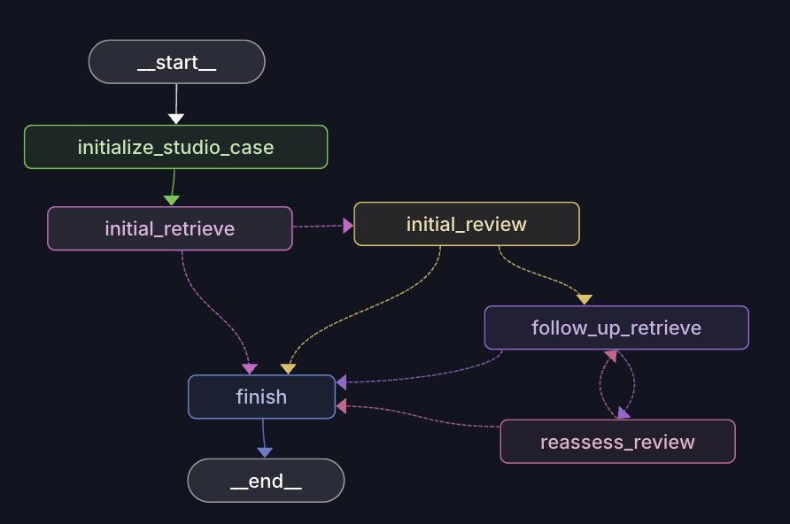

# Sammanfattning

<strong>Uppgiften: instruktioner / mitt fokus </strong>

 <!-- Syfte: påminna om uppgiften, klargöra hur jag prioriterat (samt min roll?)  -->

Uppgiftsinstruktioner <!-- Väldigt öppna! -->
- Hitta use-case dokumentprocessering, som motiverar ett "agentiskt system" (jmf workflow)
- Använd ramverk såsom LangGraph / Agno
- Mer: Prova RAG; no-vibe coding, Codex 5.6+, ~3h

Mitt fokus 
- Hitta "realistiskt" use-case *som går att utvärdera* (och förstå)
- Bygg icke-linjärt ("loopande") system i LangGraph
- Prova RAG (minimal skala)
- Automatiska kvalitetstester medelst "Evals"

<strong>Use-case sökning</strong>

 <!-- Syfte: redovisa tankeprocess  -->
Exempel dokumenttyper: Fakturor, produktbeskrivningar, användarvillkor, (externa)regleringar, juridiska avtal, CV:n

Vad utmärker problem där linjära workflow ej räcker?
- open-endedness
- selective tool use
- "miljö" som utforskas (?)

Vilka use-cases passar för demo?
- Output som går att bedömma kvalitetsmässigt
    - automatiskt via evals
    - snabbkoll av männsika
- "Begripliga" dokument tillgänliga / syntetisk datagenerering möjlig
- RAG kan motiveras

<strong>*Var* går gränsen mellan workflow / agentisk?></strong>
 
 <!-- Syfte: motivera vilken typ av system jag zonat in på  -->

Spektrum: Linear workflow -> non-linear -> agentic?

Dimensioner
- Flödesvägar i grafen (linjär, branching, loopar),
- Actions
    - antal: få -> många
    - åtkomsts-/behörightsnivåer och flexibilitet - t.ex. get_time vs rag_retrieve(...) vs readonly-DB vs sudo bash shell?
- (State vs stateless?)

<strong>Valt use case</strong>

Två idéer:
- (1) "Warranty claim investigator"
    - Bedömning av garantiärenden för industripump  <!--Avslogs pga svårt motivera RAG-->
    - input: Garanti-formulär från kund + produktbeskrivning med villkor
    - miljö / actions: begär & läs; inspektionsrapporter, driftsloggar
    - output: bevilja / avslå / eskalera inkl. motivering med dokumentreferenser

- **(2) "Policy coherence investigator"** 
    - Vad: Bedömning av intern "policykoherens" på företag**
    - input: Fråga ("Är våra polcies kring återkallande systemaccesser vid uppsägning tvetydiga?")
    - miljö / actions: Sök(RAG) & läs i policy-arkiv
    - output: flagga (in)koherens alt. oklart inkl. motivering med dokumentreferenser
    - Möjliga flöden:
        - Initial retrive+review -> finish
        - Initial retrive+review -> (loop: re-retrieve -> re-review) -> finish

- TODO: Se use-case exploren: http://127.0.0.1:8767

<strong>Go-to-prod förbättringar / blandade utmaningar</strong>

<!-- Syfte: Vad hade varit naturliga "nästa steg" om detta hade byggts som en faktiskt produkt?-->

- Större dataset, äkta dokument (utmaning: vad är ground-truth? hur utvärdera "mjuka" aspekter?)
- Benchmarka mot baseline(s):
    - Linjärt flöde med/utan RAG

- hur exponera dokument, hur lösa (tool)accesser?
- Observabilityet: beslut måsta kunna förklaras(?)

<strong>Bilder</strong>

<!-- Put image files in docs/human-zone/assets/ and link them with standard Markdown. -->

LangGraph-grafen

<strong>Scripts</strong>

uv run policy-coherence-investigator-docs docs/human-zone/project-summary.md

