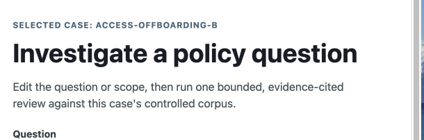

# Project summary

> A free-form working page for notes, reflections, and sketches. Edit this file directly or run
> `uv run agentic-doc-poc-summary` and open <http://127.0.0.1:8767/>.

<strong>Current understanding</strong>

<!-- What is the project trying to prove or learn right now? -->

Hello world.

<strong>Recent progress</strong>

<!-- What changed, shipped, or was learned since the last update? -->

Write here.

<strong>Decisions and rationale</strong>

<!-- Record decisions, why they were made, and any trade-offs. -->

Write here.

<strong>Open questions and risks</strong>

<!-- What still needs an answer? What could invalidate the current approach? -->

Write here.

<strong>Ideas and experiments</strong>

<!-- Capture possibilities before they become commitments. -->

Write here.

<strong>Sketches and images</strong>

<!-- Put image files in docs/human-zone/assets/ and link them with standard Markdown. -->

Example:

<strong>Next session</strong>

<!-- What is the smallest useful next step? -->

Write here.

